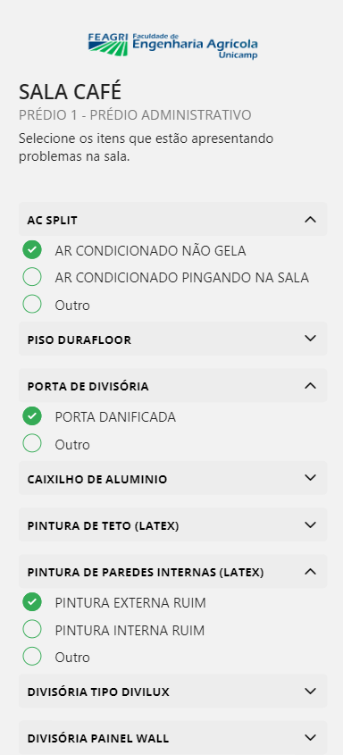
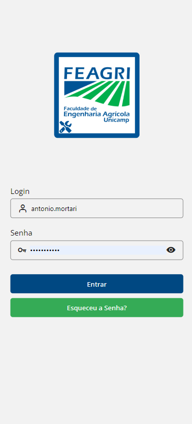
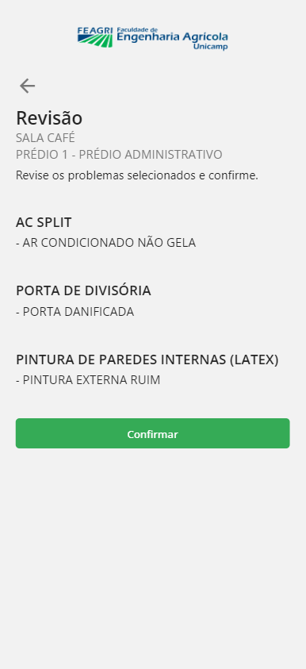

<h1 align="center"> QR Zeladoria </h1>


# Descrição

<div> 
  O QR Zeladoria é um aplicativo PWA, desenvolvido para simplificar a comunicação de problemas em ambientes e salas de aula. Permite que usuários escaneiem códigos QR code para reportar problemas diretamente à equipe de zeladoria e manutenção.
</div>


# Tecnologias utilizadas <a name="id02"></a>

<div> 

 - React Native
 - Expo
 - Expo Router
 - Typescript
 - Axios
 - Context API
 - React Hook Form e Zod para validação
  
</div>


# Clonagem e instalação <a name="id04"></a>

Clone este repositório usando o comando:

```bash
git clone https://github.com/AntonioMortari/QR-Zeladoria.git    
```

Instale na pasta do projeto as dependências:

```bash
cd QR-Zeladoria
npm i
```

Execute o projeto com o comando:
```bash
npx expo start
```

[comment]: <> (Adicione o link da implatação, se houver)

# Projeto em produção

[Você pode acessar um exemplo clicando aqui](https://www.feagri.unicamp.br/app/manutencao-zeladoria?idSala=63ec367be4c914046b2d9282)

# Imagens do projeto  <a name="id06"></a>

<div align='center'>
 
 
 
</div>

